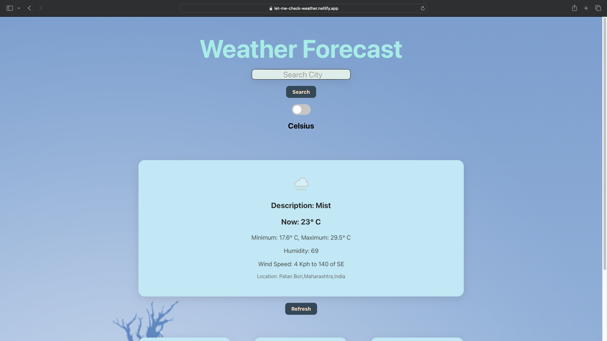
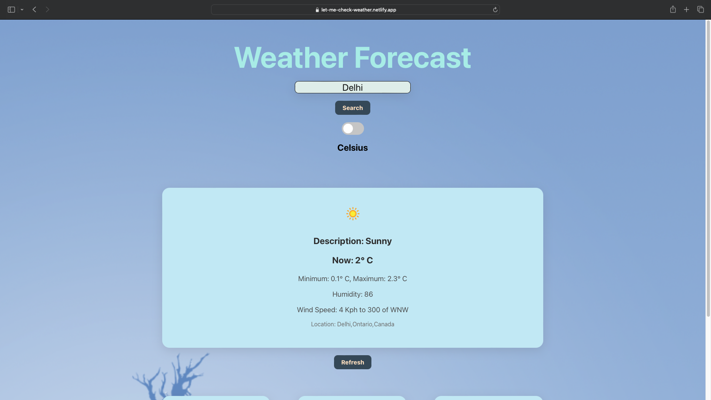
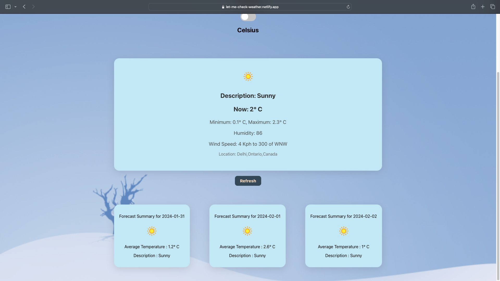

# Let Me Check Weather

Live Website: [Let Me Check Weather](https://let-me-check-weather.netlify.app)


## Project Description

**Let Me Check Weather** is a weather application that empowers users to effortlessly explore current weather conditions and a 3-day forecast for their desired city. It provides comprehensive information, including:

1. **Current Weather Details:**
   - Current Temperature
   - Minimum and Maximum Temperature
   - Humidity
   - Wind Speed and Direction
   - Description of the Weather (e.g., clear sky, light rain, etc.)
   - An Appropriate Icon Reflecting the Current Weather

2. **3-Day Forecast:**
   - Date
   - Average Temperature
   - Description of the Weather
   - An Appropriate Weather Icon

3. **Unit Toggle:**
   - Users can seamlessly switch between Celsius and Fahrenheit to view temperature details in their preferred units.

## Project Setup

Follow these steps to run the project on your local machine:

### Prerequisites

Make sure you have the following prerequisites installed:

- [Node.js](https://nodejs.org/)
- [npm](https://www.npmjs.com/) (Node Package Manager)

### Installation

1. Fork the repository to your GitHub account.
2. Clone the forked repository to your local machine.

```bash
git clone https:/Ritik-Bhardwaj-007/github.com//Weather_Forecast_Task.git
cd weather_forecast_task
```

In the project directory, Install dependencies:

### `npm install`

Start the application on your machine.

### `npm start`
Visit [ http://localhost:3000](http://localhost:3000) in your browser to explore Let Me Check Weather.

### Project Images






